# NextGen Manager Challenge 2026

Website cuộc thi **NextGen Manager Challenge 2026 – The Manager in the AI Era** của Khoa Kinh tế và Quản lý, Trường Quốc tế – ĐHQGHN.

| | Địa chỉ |
| --- | --- |
| Website thí sinh (VI / EN) | https://nextgen.vnuis.edu.vn · https://nextgen.vnuis.edu.vn/en/ |
| Trang quản trị Ban Tổ chức | https://nextgen.vnuis.edu.vn/admin |

**Trạng thái: hoàn thành (phiên bản 1.0, tháng 10/2026).** Toàn bộ giao diện thí sinh và trang quản trị có hai ngôn ngữ Tiếng Việt / English.

## Giao diện

### Website thí sinh

| Trang chủ | Trên điện thoại |
| --- | --- |
| 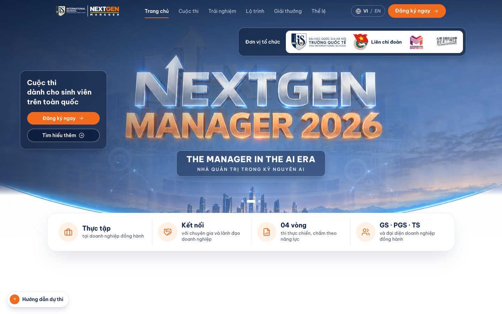 | 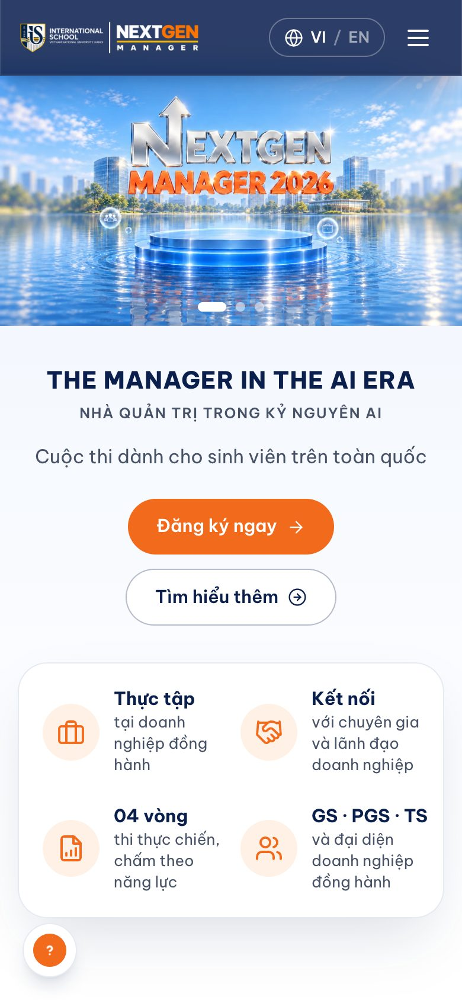 |

| Đăng ký dự thi | Thể lệ (English) |
| --- | --- |
| 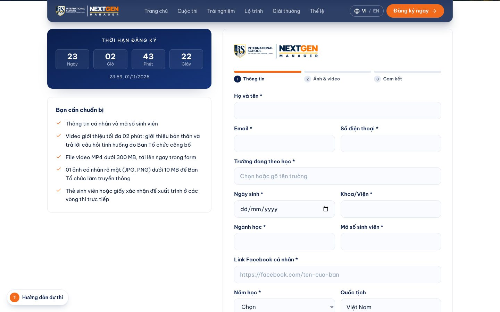 | 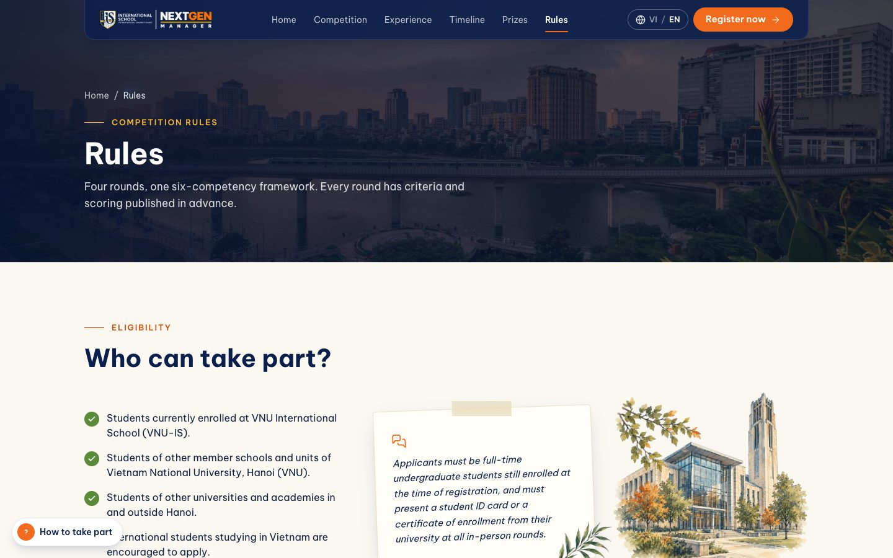 |

| Lịch thi của thí sinh | Phòng thi Vòng 1 |
| --- | --- |
| 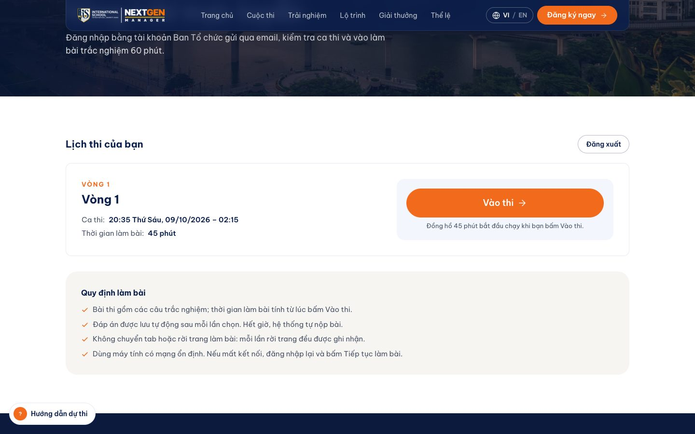 | 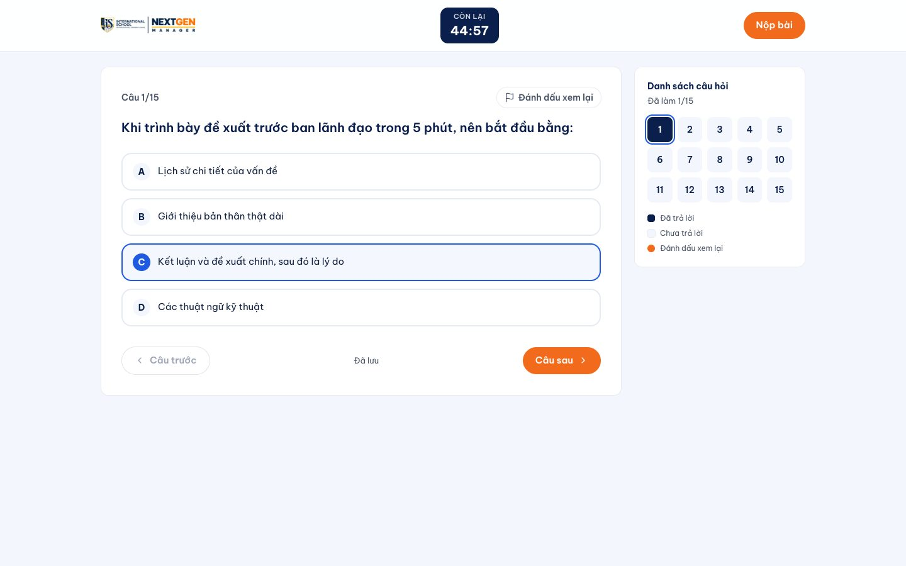 |

### Trang quản trị

| Đăng nhập (mật khẩu + mã email) | Tổng quan |
| --- | --- |
| 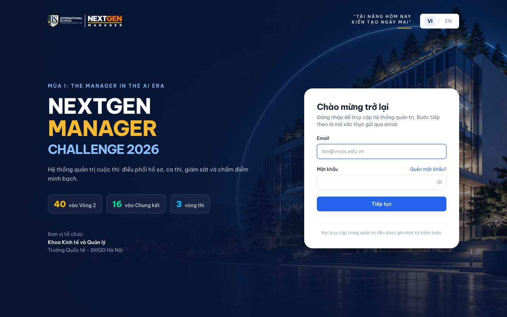 | 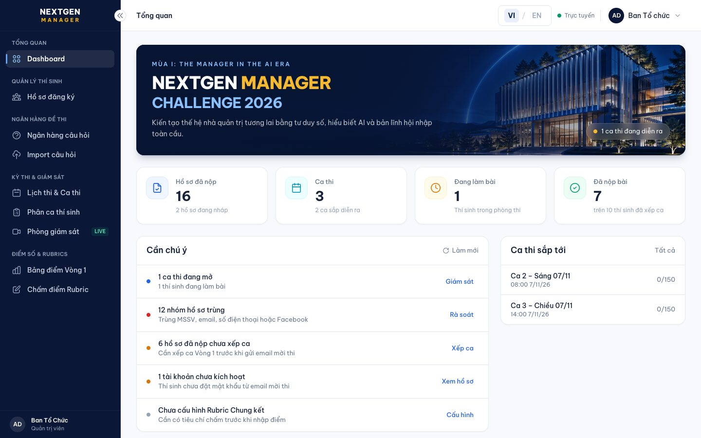 |

| Hồ sơ đăng ký | Chi tiết hồ sơ và video giới thiệu |
| --- | --- |
| 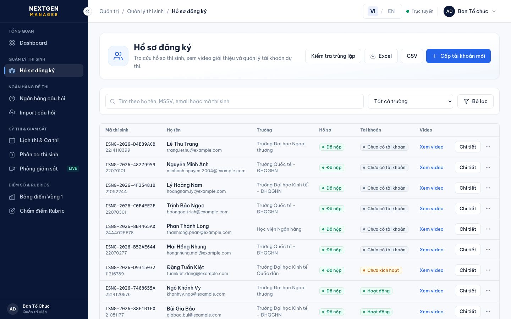 | 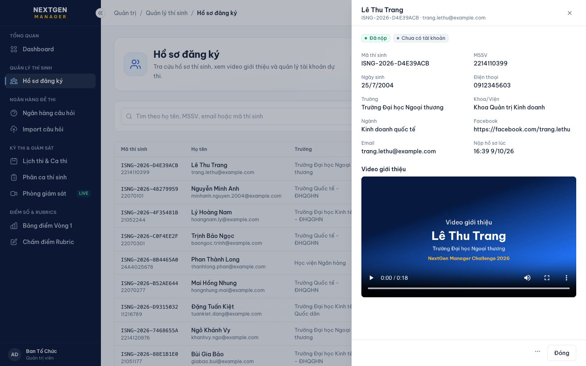 |

| Phân ca và gửi email mời thi | Phòng giám sát trực tiếp |
| --- | --- |
| 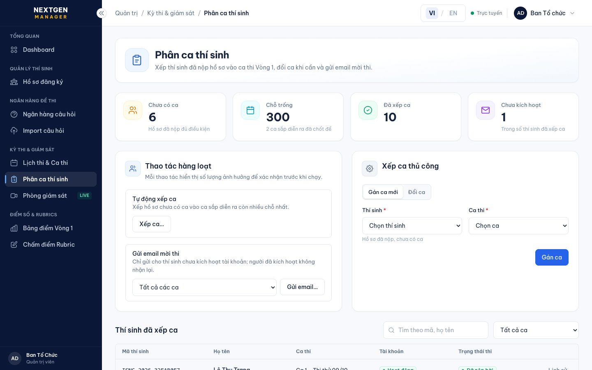 | 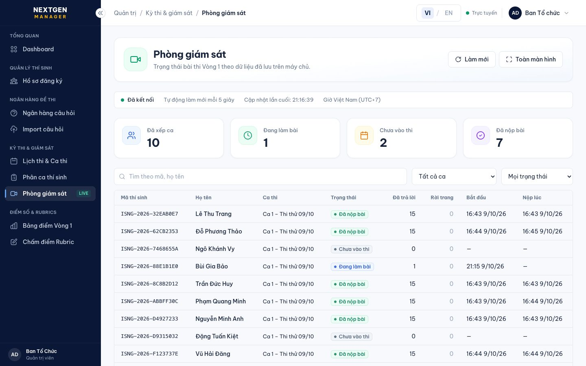 |

| Bảng điểm Vòng 1 | Chấm điểm Rubric |
| --- | --- |
| 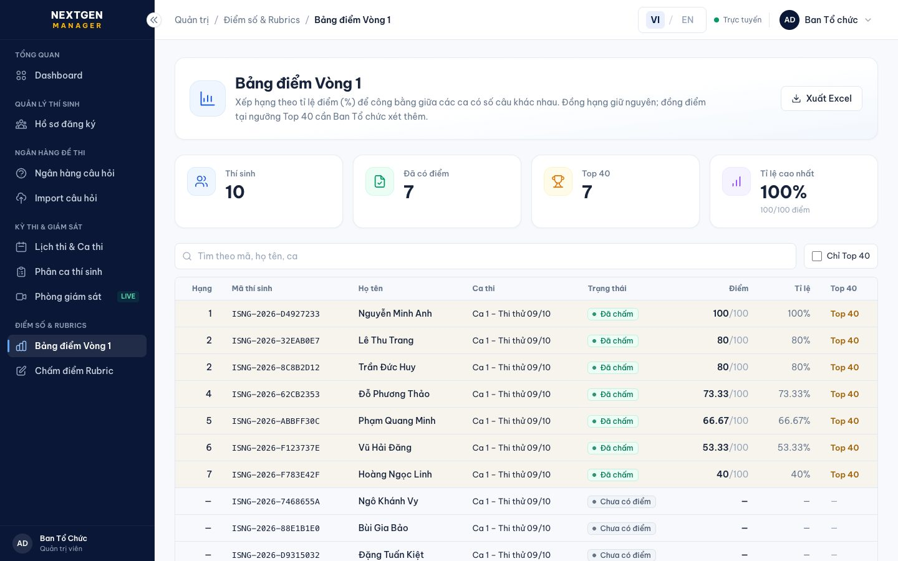 | 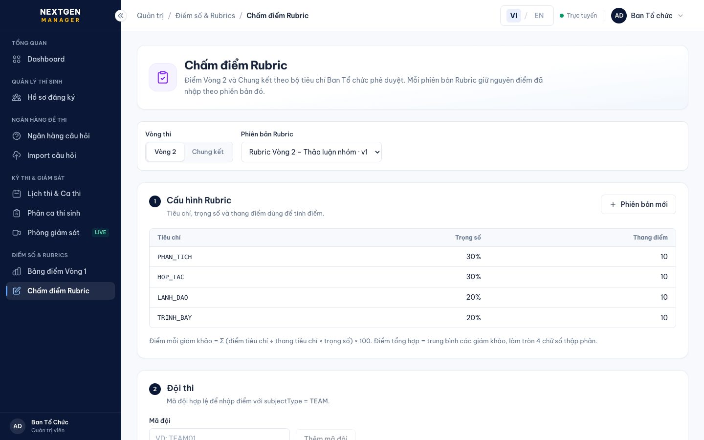 |

| Trang quản trị bản tiếng Anh |
| --- |
| 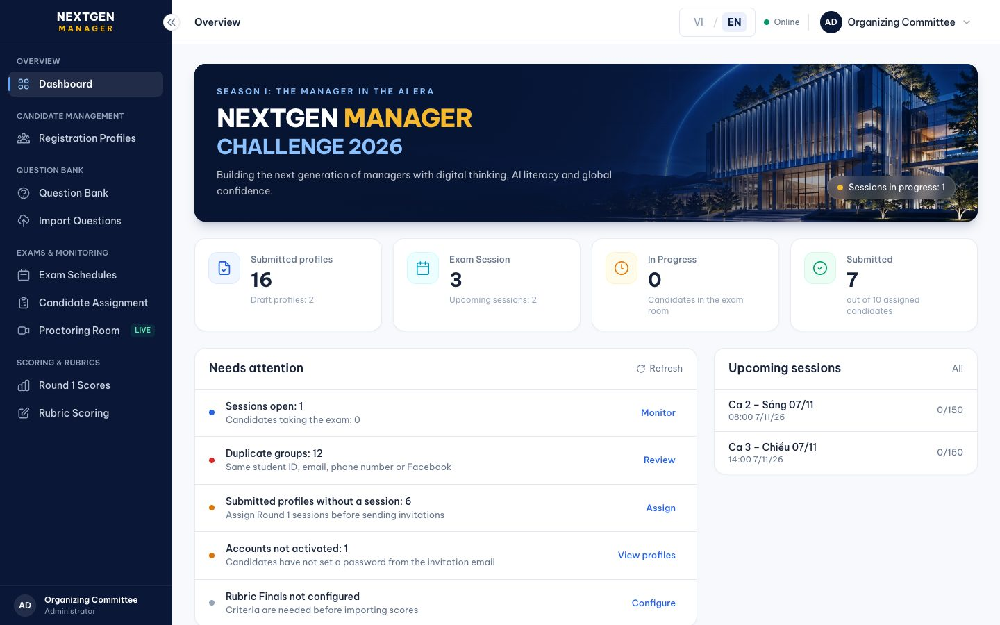 |

Ảnh trang quản trị và phòng thi dùng dữ liệu thử, không phải thí sinh thật.

## Tính năng

**Thí sinh**
- Trang giới thiệu cuộc thi, thể lệ, lộ trình, giải thưởng, kết quả từng vòng; hướng dẫn dự thi từng bước ngay trên trang.
- Đăng ký 3 bước: thông tin cá nhân → ảnh chân dung và video giới thiệu (MP4, dưới 2 phút) → cam kết; nhận mã thí sinh và email xác nhận.
- Kích hoạt tài khoản thi và đặt mật khẩu bằng mã 6 số gửi qua email; tự đặt lại mật khẩu khi quên.
- Thi trắc nghiệm Vòng 1 trực tuyến: đồng hồ theo giờ máy chủ, tự lưu từng đáp án, đánh dấu xem lại, tự nộp khi hết giờ, ghi nhận rời trang, tiếp tục làm bài khi mất kết nối.

**Ban Tổ chức**
- Đăng nhập hai lớp (mật khẩu + mã xác thực qua email), nhật ký kiểm toán mọi thao tác.
- Tổng quan: số liệu chính và danh sách việc cần xử lý.
- Hồ sơ đăng ký: tìm kiếm, lọc, xem video, xuất Excel/CSV; kiểm tra hồ sơ trùng (MSSV, email, số điện thoại, Facebook).
- Tài khoản thí sinh: cấp mới, khoá/mở khoá, cấp lại mật khẩu, xoá.
- Ngân hàng câu hỏi: thêm/sửa theo phiên bản, nhập hàng loạt từ Excel hoặc Word.
- Ca thi Vòng 1: tạo ca (giờ mở/đóng, thời lượng, sức chứa), đề được chốt ngẫu nhiên từ nhóm câu hỏi; xếp ca tự động hoặc thủ công, đổi ca có lý do; gửi email mời thi.
- Phòng giám sát cập nhật mỗi 5 giây; bảng điểm Vòng 1 xếp hạng theo tỉ lệ điểm, Top 40, xuất Excel.
- Chấm điểm Rubric Vòng 2 và Chung kết: cấu hình tiêu chí/trọng số theo phiên bản, nhập điểm giám khảo từ Excel, bảng tổng hợp.

## Công nghệ

| Phần | Công nghệ |
| --- | --- |
| Website thí sinh | Next.js 16 (xuất web tĩnh), React 19, Tailwind CSS 4, Driver.js |
| Trang quản trị | Next.js 16 (chạy server, `src/app/admin`), cùng bộ giao diện |
| Backend | NestJS 11, Prisma 6, PostgreSQL 16, Redis (tuỳ chọn), Docker |
| Email | SMTP (Gmail của nextgen@vnuis.edu.vn) |
| Lưu video | Máy chủ, tự sao chép sang Google Drive của Ban Tổ chức |
| Máy chủ | Ubuntu + nginx (HTTPS, header bảo mật) tại 112.137.143.140 |

## Nhánh mã nguồn

| Nhánh | Nội dung | Triển khai |
| --- | --- | --- |
| `candidate` | Website thí sinh + backend thí sinh | `scripts/deploy.sh`, `scripts/deploy-backend.sh` |
| `main` | Toàn bộ mã của cả hai vai trò (website, backend, trang quản trị). Nhánh `candidate` được gộp vào `main` sau mỗi thay đổi | `scripts/deploy-admin.sh` (trang `/admin`) |

## Cấu trúc thư mục

```
src/
  app/(vi)/, app/(en)/en/   các trang tiếng Việt và tiếng Anh (trang chủ, thể lệ, đăng ký, kết quả, thi)
  app/admin/                trang quản trị (nhánh main)
  components/               giao diện dùng chung; components/exam: cổng thi, kích hoạt, phòng thi
  components/admin/         trang quản trị: operations/* (từng trang), ui/kit (bộ giao diện)
  content/site.ts, site.en.ts   nội dung chữ hai ngôn ngữ
  lib/                      gọi API, đăng ký, kết quả, i18n
  lib/i18n/                 từ điển trang quản trị (admin-translations.ts) và hàm tr()
backend/
  src/                      NestJS: đăng ký, media, xác thực, thi, chấm điểm, email, quản trị
  prisma/                   schema và migration
  test/                     unit, integration, contract, release-gate
deploy/admin/               docker compose của trang quản trị
public/                     ảnh, logo, data/results.json
scripts/                    triển khai, header bảo mật nginx, uỷ quyền Google Drive, sinh ảnh
assets/                     logo gốc do Ban Tổ chức cung cấp
docs/                       tài liệu kỹ thuật và ảnh giao diện
```

## Chạy ở máy

```bash
# Backend + PostgreSQL + Redis + Mailpit (xem email thử ở http://localhost:8025)
cd backend && cp .env.example .env && docker compose up -d

# Website thí sinh
cp .env.example .env.local     # đặt NEXT_PUBLIC_API_URL tới backend
npm install
npm run dev                     # http://localhost:3000

# Trang quản trị (nhánh main)
BACKEND_URL=http://127.0.0.1:3001 npm run dev    # http://localhost:3000/admin
```

Tạo tài khoản Ban Tổ chức đầu tiên:

```bash
docker exec -it -e ADMIN_PASSWORD='...' nextgen-backend-backend-1 node dist/cli/create-admin.js ten@vnuis.edu.vn
```

Kiểm thử backend: `cd backend && npm test` (và `test:integration`, `test:contract`, `test:release-gate`).

## Biến môi trường

- Website: [.env.example](.env.example) – quan trọng nhất là `NEXT_PUBLIC_API_URL`.
- Backend: [backend/.env.example](backend/.env.example) – `DATABASE_URL`, `SMTP_URL`, `PUBLIC_SITE_URL`, `GOOGLE_DRIVE_*`.
- Trang quản trị: `deploy/admin/.env` trên máy chủ (`POSTGRES_PASSWORD`, `SMTP_URL`, `GOOGLE_DRIVE_*`).

Không đưa lên git: `.env*`, `client_secret_*.json`, `drive-token.json`, mật khẩu ứng dụng Gmail.

## Triển khai

```bash
SSHPASS=... scripts/deploy.sh            # website thí sinh (build tĩnh rồi rsync lên máy chủ)
SSHPASS=... scripts/deploy-backend.sh    # backend (docker compose trên máy chủ, tự chạy migration)
SSHPASS=... scripts/deploy-admin.sh      # trang quản trị, chạy từ nhánh main
```

Máy chủ khoá SSH tạm thời nếu kết nối liên tục nhiều lần: chờ vài phút rồi chạy lại.

## Hai ngôn ngữ

- **Website thí sinh:** mỗi trang có bản `/…` (Tiếng Việt) và `/en/…` (English); nút **VI / EN** giữ nguyên trang đang xem. Chữ nằm trong `src/content/site.ts`, `site.en.ts` và đối tượng `copy`/`text` `{ vi, en }` của từng component.
- **Trang quản trị:** nút **VI / EN** ở góc trên, lựa chọn lưu trên trình duyệt. Câu tiếng Việt viết trong `tr("…")` hoặc `t("…")`; bản tiếng Anh ở `src/lib/i18n/admin-translations.ts` (khoá là chính câu tiếng Việt, `{0}`, `{1}` là giá trị chèn vào). Thêm chữ mới thì thêm dòng tương ứng vào từ điển.
- **Kết quả từng vòng:** `public/data/results.json` hoặc Google Sheet; cột `roundEn`, `titleEn`, `dateEn` (hoặc `round_en`, `title_en`, `date_en`) là bản tiếng Anh.
- Dữ liệu do người dùng nhập (tên thí sinh, trường, nội dung câu hỏi, tên ca thi) giữ nguyên như khi nhập. Email gửi thí sinh viết bằng tiếng Việt.

## Tài liệu bàn giao

- **Sổ tay sử dụng website (PDF)** – hướng dẫn bằng hình ảnh từng bước cho Ban Tổ chức và thí sinh.
- **10 video hướng dẫn** – các thao tác thường dùng; chức năng liên quan hai bên quay song song màn hình Ban Tổ chức và thí sinh, chức năng một bên quay song song máy tính và điện thoại.

Hai tài liệu này được gửi kèm khi bàn giao (không nằm trong kho mã).
